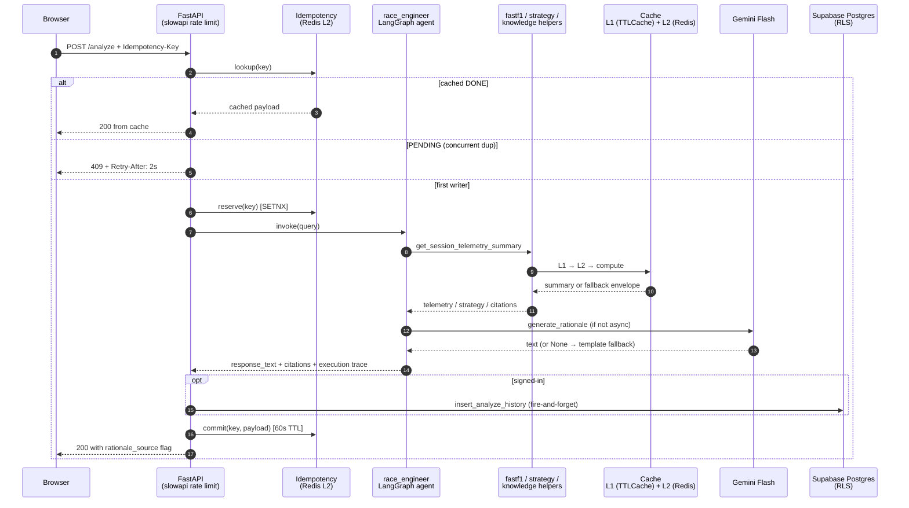
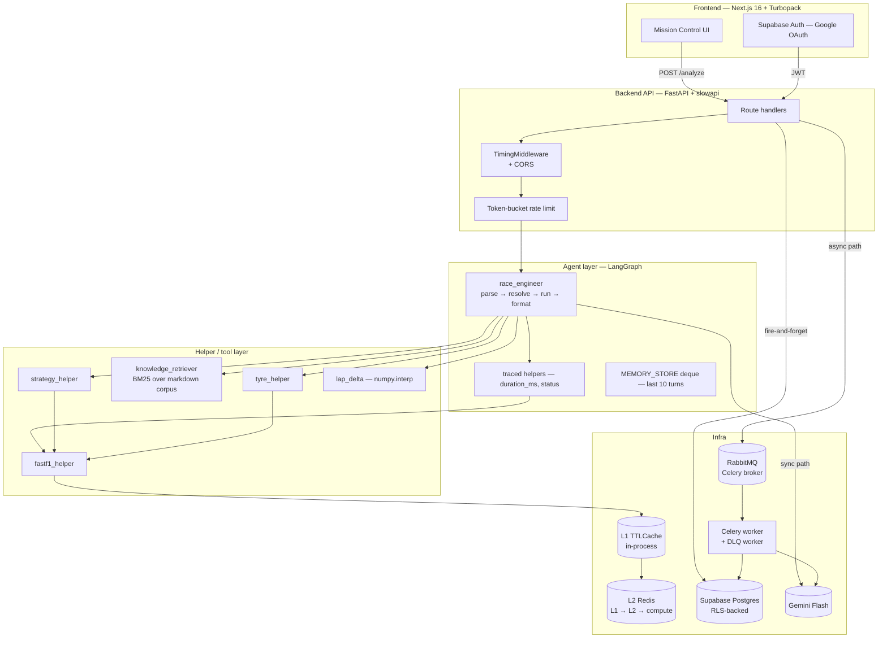

# Architecture

A 5-minute read for someone who wants to know *why* the code looks the way
it does, not just what it does. Each section names a decision, the
trade-off, and where to look in the code.

If you only have 60 seconds, the four big bets are:

1. **Fail-closed envelopes everywhere** — every helper returns a populated
   dict with `fallback: True` instead of raising. The API never 5xxs
   because of a sparse practice session, and the UI can render an honest
   "data unavailable" state with the actual reason.
2. **L1 in-process + L2 Redis cache, both fail-open** — repeated FastF1
   lookups stay sub-50ms after warm-up. A Redis outage degrades silently
   to "L1 only" rather than taking the API down.
3. **BM25 over a curated markdown corpus, not a vector DB** — RAG
   citations work today on a $0 infra spend; revisit when the corpus
   exceeds ~50 entries.
4. **Async LLM rationale through Celery + RabbitMQ + DLQ, opt-in only**
   — signed-in users can flip `RATIONALE_ASYNC=true` for instant template
   responses while a worker back-fills the LLM text. Anonymous callers
   always take the synchronous path so nobody sees a degraded
   "template-only" UX.

---

## Request flow — `POST /analyze`

The most-exercised path. A user types a strategy question into Mission
Control; the response shapes both the agent text and the chart panels.

The Async LLM rationale path (#139 PR3, opt-in via `RATIONALE_ASYNC=true`)
forks at step 11: the synchronous response carries the deterministic
template plus a `rationale_job_id`, while a Celery worker back-fills the
LLM text onto the persisted history row. The frontend polls
`/analyze/history` and swaps the text in once the row's `rationale_source`
flips from `template` to `llm`. Bounded retries + DLQ surfaced on
`/admin`.

---

## Layered architecture

Notes on the layout:

- **Routes are thin.** Most logic lives in helpers under `backend/tools/`.
  This keeps the FastAPI surface easy to skim and the helper layer
  testable without spinning up an HTTP client.
- **The agent is a small LangGraph state machine** (4 nodes — parse,
  resolve_followup, run_analysis, format_response) instead of a free-form
  tool-loop. Step + duration limits are enforced at the graph boundary so
  a runaway tool can't burn the request.
- **Helpers are pure functions of input + cache.** No hidden mutable
  state. Tracing is a decorator (`@traced`) so the trace shows every tool
  call, its duration, and its status, surfaced in the response under
  `execution.trace`.

---

## Decisions worth calling out

Each row: what was picked, what got rejected, and the cost we accepted.

| Decision | Picked | Alternative | Cost we accepted |
|---|---|---|---|
| **Fail-closed envelope on every helper** | Populated dict with `fallback: True` + reason | Raise on FastF1 hiccups | Every endpoint has to special-case nothing — the cost lives in the helpers, not the routes. |
| **BM25 over curated markdown for RAG** | `rank-bm25` indexing 13 hand-written `.md` files at import | pgvector / Chroma + embeddings | No semantic similarity. Mitigated by tag-aware tokenisation; revisit when corpus exceeds ~50 entries. |
| **L1 in-process + L2 Redis cache** | `cachetools.TTLCache` (per-process) → Redis (shared) → compute | Single-tier Redis | Two cache layers to invalidate, but multi-worker deployments share warm state and a Redis outage degrades to L1-only. |
| **Async LLM rationale opt-in only** | `RATIONALE_ASYNC=true` flag, signed-in users only | Always-async | Anonymous users still pay LLM latency in-line, but they never see a "template-only" response with no upgrade route. |
| **Celery + RabbitMQ + DLQ** | Real broker with bounded retries (3× exponential backoff) | Redis-as-broker / synchronous everything | RabbitMQ is one more container to operate, but it gives us in-flight + queue-depth observability and a dead-letter queue for permanent failures. |
| **`numpy.interp` for lap-vs-lap Δt** | Align both drivers' telemetry on a shared distance grid, rebase `SessionTime` per-lap | `fastf1.utils.delta_time` | Wrote ~50 lines of helper. The library helper is deprecated and known-inaccurate, so this was unavoidable. |
| **Idempotency key in route layer** | SETNX in Redis with 60s TTL, `Retry-After: 2` on PENDING | At-least-once everywhere | Slightly more code in `/analyze`. Pays off because a network retry doesn't double-write history rows or burn duplicate Gemini quota. |
| **Build-time `NEXT_PUBLIC_*` injection codified in compose** | `${VAR:?msg}` interpolation guards + `URL ✗ KEY ✗` diagnostic pill in AuthButton | Runtime env injection | More verbose compose file. Pays off because the next prod-only auth misconfig is self-explaining instead of a 30-minute debug. |
| **Yarn 4 with `nodeLinker: node-modules`** | Deterministic immutable installs via corepack-pinned yarn | Yarn Berry PnP | Larger `node_modules/`. Yarn PnP would be smaller but breaks Next 16 + Turbopack today. |
| **Hardened staging compose by default** | Redis with `requirepass` + renamed `CONFIG`/`FLUSHALL`, no host port mapping, `maxmemory + allkeys-lru` | Dev-style "everything on localhost" | More config. Pays off because the staging stack is the same shape as prod — recruiter can `make stack-up` and trust the result. |

---

## Reliability patterns by layer

What happens when each piece breaks. Read down the rows for "what should I
worry about as an operator?"

| Failure | What breaks | Degradation strategy |
|---|---|---|
| FastF1 returns sparse/empty | Strategy / telemetry / tyre helper | Fail-closed envelope with `fallback_reason`; UI renders honest unavailable state |
| FastF1 raises a transient timeout | First call after a cold start | Helper retries with exponential backoff (in `_call_with_retry`); after `MAX_TOOL_RETRIES` envelope flips to fallback |
| Gemini API key missing or rate-limited | LLM rationale | `generate_rationale` returns `None`; caller falls back to deterministic template, response flag flips to `rationale_source: "template"` |
| Redis L2 unreachable | Cache + idempotency | Helpers fall through to L1 only; idempotency dedupe disabled (fail-open); `/metrics` shows `redis_enabled: false` |
| Supabase JWKS endpoint down | Auth verification on signed-in routes | 401 — but core Mission Control flow works anonymously; only history/saved-queries panels degrade |
| RabbitMQ unreachable | Async rationale enqueue | `/analyze` falls back to synchronous LLM path; `/admin` shows `broker_reachable: false` and `queue_depth: 0` |
| Celery worker crashloop | DLQ workflow | Bounded retries (3×) → DLQ; DLQ consumer is on its own container so a regression there can't take down regular task processing |

The pattern: every dependency has a fail-open or fail-closed contract,
and `/metrics` exposes a boolean for each so an operator can see
*which* piece is unhealthy without reading the routes.

---

## Where to look in the code

| Concern | File |
|---|---|
| Route surface + middleware order | `backend/app/main.py` |
| Agent graph + state shape | `backend/agents/race_engineer.py` |
| Telemetry helpers + cache wiring | `backend/tools/fastf1_helper.py` |
| Strategy heuristic + scenario compare | `backend/tools/strategy_helper.py`, `backend/tools/strategy_compare.py` |
| RAG retrieval + corpus | `backend/tools/knowledge_retriever.py`, `backend/rag/corpus/*.md` |
| LLM client + system prompt | `backend/core/llm.py` |
| Async rationale task | `backend/tasks/rationale.py` |
| Idempotency layer | `backend/core/idempotency.py` |
| Mission Control HUD | `frontend/src/components/mission-control/StrategyHUD.tsx` |
| Citation chips + popover | `frontend/src/components/mission-control/ReferencesPanel.tsx` |
| Scenario comparison | `frontend/src/components/mission-control/ScenarioComparison.tsx` |
| Hardened staging compose | `docker-compose.staging.yml` |

---

## Things deliberately *not* done

- **No vector embeddings.** BM25 + a 13-file curated corpus covers every
  current demo scenario. Adding embeddings would mean Supabase pgvector
  or Chroma — net new infra and a retraining loop — for marginal benefit
  at this corpus size.
- **No live timing ingest.** All telemetry comes from FastF1 cached files.
  Live Pirelli/F1 timing-feed parsing is in scope eventually but
  intentionally postponed because it would expand the surface from
  "explainable analysis" to "real-time pipeline" before the explainable
  analysis side feels done.
- **No multi-tenant Postgres.** Supabase RLS gates rows by `auth.uid()`,
  but the schema isn't sharded — solo MVP, not a SaaS spin-out.
- **No SSE / WebSocket.** Async rationale upgrades use polling on
  `/analyze/history` because the worker pool is single-node and HTTP
  polling is simpler than maintaining a long-lived connection layer.
  Revisit when the worker pool moves to multi-node and the connection
  count starts mattering.
